\@DavidGerding, August 5, 2017

What’s This?
------------

In my estimation, as of today, here’s the real-world way to get Xamarin Forms
working with Visual Studio 2017 and the current Azure Mobile Client (4.0) for
backend support. It’s a *slower* quick start, to be sure. But it builds and
runs, which is nice. It also pivots the template to the .net Standard target for
the Xamarin.Forms project which is good as it’s the “standard” path ahead.

<blockquote>
I sincerely hope that this little blog post gets in front of the folks at
Xamarin and their colleagues on the Azure side of Microsoft and they come
together to a common best vision for Xamarin solution templates and “quick
starts”. My preference is they create a few different flavors of the Xamarin
Forms solution template: “Basic”, “Persistence-Enabled”, “Persistence and
Authentication Enabled”. I would think that there should be a flavor for both
Entity Framework and Node.js backends - or even better a provider-based
implementation that let you choose at runtime!

In the meantime, there’s this :)
</blockquote>

The Repo Is a Walkthrough and the Walkthrough Is a Repo
-------------------------------------------------------

I tried to incrementally commit, with notes, the project in this repo so that
this “readme" can refer directly to commits at different steps of the
walk-through.

The most recent commit should be the last step, naturally, of the walk-through.
But, if you pulled the repo, you can “walk through" the commits to get to the
working solution.

Background
----------

Currently there are at least three notions of a “Quickstart” for Xamarin Forms
with an Azure backend solution:

-   The Visual Studio template for Visual Studio 2017 for Windows

-   The Mobile App Quickstart client project that you can get if you create a
    new Xamarin forms project using the Azure Quickstart website process

-   And, when I last looked the Visual Studio for Mac Xamarin Forms presents yet
    another flavor of “getting started”

In my estimation, the current Visual Studio 2017 for Windows template has a
somewhat tighter and more contemporary notion of Xamarin Forms practices. For
example, it includes the use of dependency service etc… **So, this walkthrough
uses the Visual Studio 2017 Windows solution template.**

<blockquote>
**Gotcha! Use Xamarin Updater**

Make sure you have all the standard Visual Studio 2017 updates installed. Also,
ensure that you have installed the Xamarin Updater before you proceed. Then make
sure you have all the latest (stable channel) updates. This walkthrough uses the
newest stable Xamarin Forms “vsix” Template extension.
</blockquote>

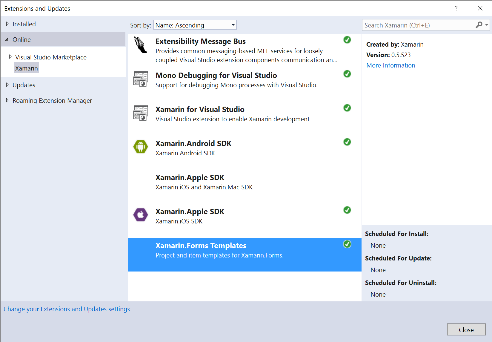

Assumptions
-----------

I am using the following tools and versions:

-   Visual Studio 2017 for Windows (release not preview) with all standard
    release updates

-   Visual Studio 2017 for Mac as the iOS build platform. Again, release not
    preview, with all standard updates

-   Xamarin stable channel for all the above

-   Only Stable Nuget releases with the sole exception being Xamarin.Forms
    itself, which requires the pre-release version 2.3.5 Pre-6 Version to work
    with .net Standard.

Act 1 – Getting the Solution Running and Talking to Azure
=========================================================

At the end of the “first act” we’ll have both local and remote Azure persistence
running and, significantly, a .net Standard Xamarin Forms project that really
runs on iOS, Android and UWP:

The functionality above is functionally equivalent to the last step of the Azure
Mobile Getting Started here:

<https://docs.microsoft.com/en-us/azure/app-service-mobile/app-service-mobile-xamarin-forms-get-started-offline-data>

but avoids some of the “gotchas” to getting code running on all three platforms
with current libraries.

Step 1 - Ready Your Azure Environment
-------------------------------------

Note: *This walk-through uses a SQL database and entity model for the backend.
If you prefer the Node.js backend you can still learn from this walk-through but
some of it won’t be as relevant. However, I prefer the
asp.net/controller-oriented backend. I also wanted to include what I had learned
about getting entity models to update in the Azure space using Migrations, so
that’s what’s covered later.*

I’ve learned from experience that everything is easier if you configure some
basic Azure settings *before* you get started with Visual Studio solution. If
you don’t make your own resources in advance the Visual Studio solution will
auto-create Azure resources that default to *paid* services. No fault to
Microsoft: they have lights to keep on :-). The following extra steps can help
you skip surprise fees and you can update to paid service levels when things are
working the way you want.

Configuring a Resource Group in Azure is, by design, a handy way to organize
related Azure resources for entire projects. They also can help you ensure
you’re at a pricing tier you need during learning or development.
---
**NOTE**
**Gotcha! Double-Check Your Azure Resource Locations**

I’ve learned the hard way that Azure won’t default to a common service location.
Make sure that both the Resource Group and the resources you add are
*geographically close to you* and *all in the same geolocation* as you add them.
---

### Create an Azure Resource Group

Start by creating an Azure Resource Group for your new project.

<https://docs.microsoft.com/en-us/azure/azure-resource-manager/resource-group-portal>

### Create an Azure App Service Plan

Next create an Azure App Service Plan. An app service and lets you specify
things like pricing and region for the app services that go into the plan.

<https://docs.microsoft.com/en-us/azure/app-service/azure-web-sites-web-hosting-plans-in-depth-overview>

### Create an Azure SQL Server and Database

Once you’ve added the Resource Group you’ll want to create a SQL Server resource
at the free or nearly free provisioning level. You can then create the database
that you will use to persist your app items.

<https://docs.microsoft.com/en-us/azure/sql-database/sql-database-get-started-portal>

So, *before* you create your Visual Studio solution you’ll want to have created
an Azure Resource Group that contains the following project resources:

-   An AppServicePlan set, presumably, to the free (F1) pricing tier

-   A SQL Server resource set the to the lowest cost/free pricing-tier

-   A SQL Server database on the SQL Server resource

We’ll reference each of these resources using the “New Cross Platform App”
settings wizards in the next step.

Step 2 – Create a New Solution with Azure Backend
-------------------------------------------------

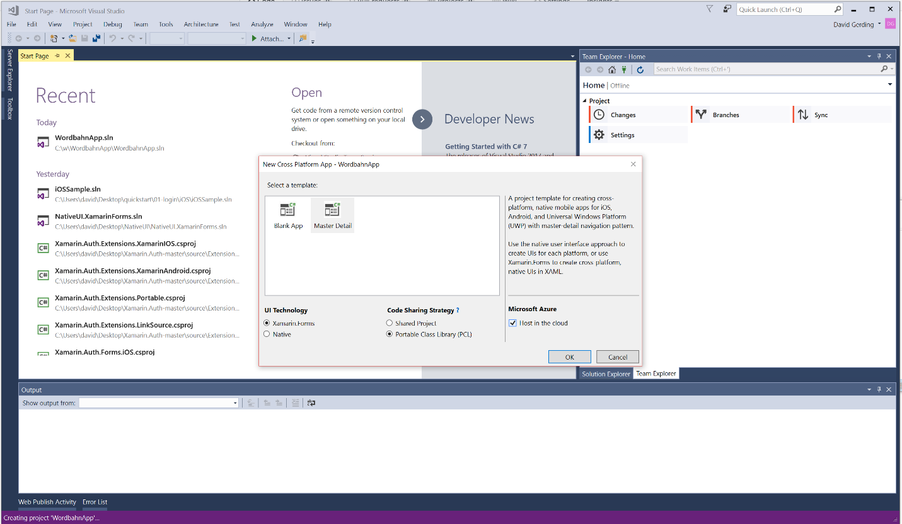

### Create New Cross Platform Xamarin Forms App with Master Detail and PCL

Note that this walk-through assumes you are building a Xamarin forms project
with a Portable Class Library (“PCL”) project as the base Xamarin forms project.
PCL projects are being deprecated, eventually, in favor of .net Standard. You
can read some more about that here:

<https://blog.xamarin.com/net-standard-library-support-for-xamarin/>

I’ll cover converting the PCL project to .net Standard later in the walkthrough
in the “Act 2” repo.

Also, note that we are adding the Azure “host in cloud” option at this starting
point.

### Configure Hosting Settings

After clicking ok, the solution backend wizard dialogs will appear. First, SLOW
DOWN. *Don’t* click Create yet.

On the Hosting tab carefully match the mobile app name and other Azure based
properties to the resources you created in the prior step. If you’re logged in
to the right account the Subscription, Resource Group and App Service plan you
created earlier will be discoverable and selectable in the drop downs.

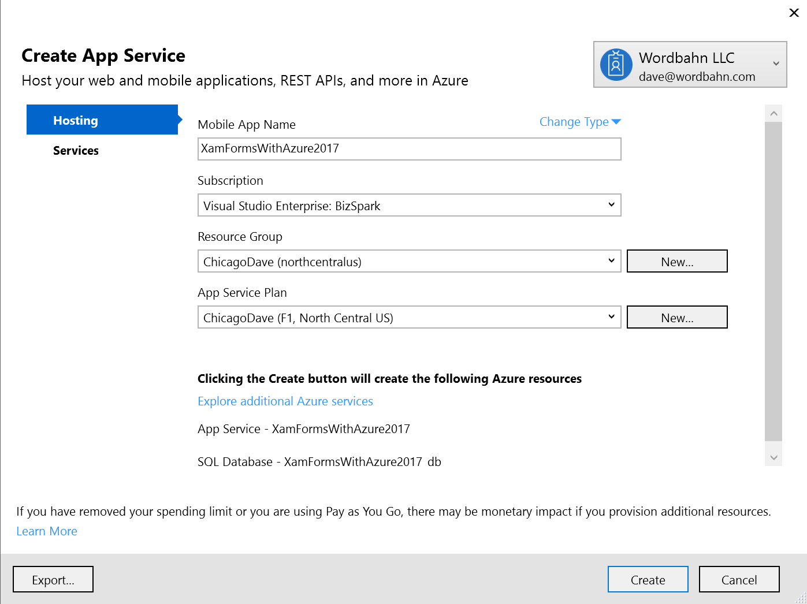

**Gotcha: Check your credentials!**

In the upper-right corner of the solution backend dialog box make sure you are
signed in using the same account you used to create your Azure resources.

### Configure Services/DB Settings

Now go to the Services tab.

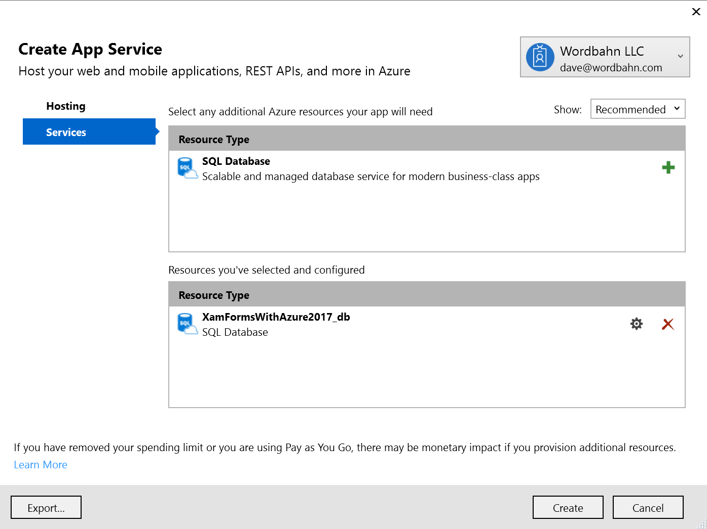

Set the project to reference the SQL database resources you also created in the
prior step.

Step 3 – Ready the Native Projects for Build
--------------------------------------------

Don’t bother to build. Your solution won’t compile right out of the gate. The
first thing you need to do is restore, *but do not update*, your Nuget packages
for the solution.

### Ready the iOS Project Credentials

I’m assuming you have already installed the stable version of Visual Studio for
Mac 2017 and have access to a build platform that is connected. To build any iOS
project, you need to have iOS app credentials. Here are some handy links to
learn how to do that:

<https://developer.xamarin.com/guides/ios/getting_started/installation/device_provisioning/>

**Gotcha! Use the Stable Channel and Match Your Release Channels**

Make your Visual Studio 2017 for Mac and VS Win machines are both on the Stable
Xamarin channel. You want your two Visual Studio ecosystems talking apples and
apples.

Once you have your Mac build machine configured and you’ve downloaded your iOS
provisioning certificates for the app to that machine, the important piece of
information you need to build successfully back on Visual Studio for Windows is
the **Bundle Identifier**. That’s the Java-style reverse namespace that uniquely
identifies your app.

### Add the Bundle Identifier to Info.Plist

Using the nice new Info.plist properties editor in Visual Studio, open the
Info.plist file in the iOS project and add the Bundle Identifier from the app
mobile provision you created.

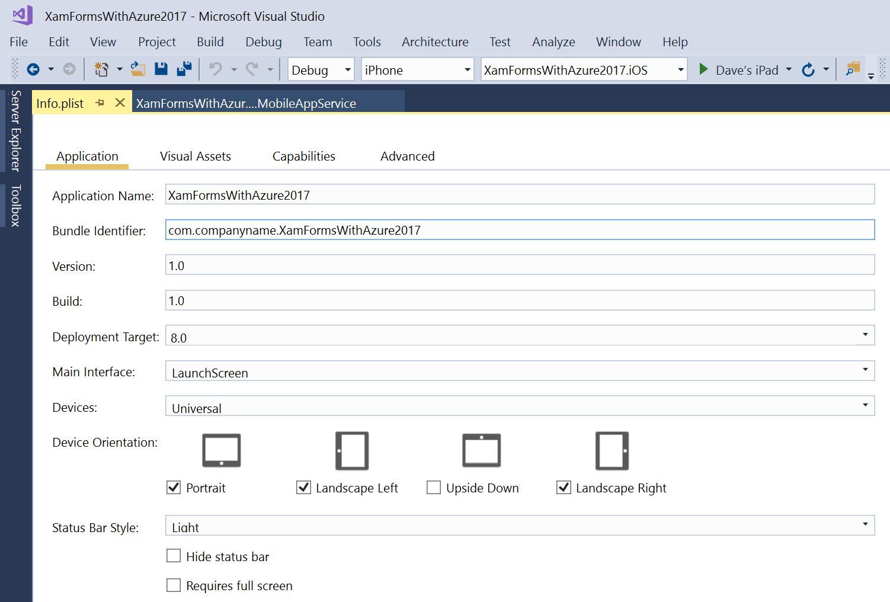

Note: *Your iOS mobile app simply won’t build without a bundle identifier that
has matching mobile provision and signing credentials from Apple on your Mac dev
machine. Getting the iOS credentials set up is a painful process the first time
but it gets a lot easier and there are handy tool improvements coming from
Xamarin and Microsoft on this front.* [todo: add link]

### Set the UWP Project to Deploy

To run the UWP project you need to add the Deploy option in the Solution
properties.

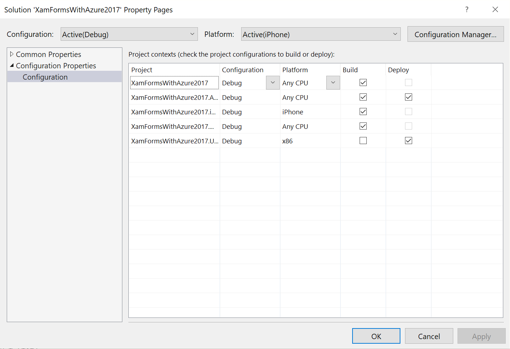

### First Build!

At this point, the solution should build and each project should be able to
deploy to a real device and run.

**Gotcha! DON’T BLINDLY UPDATE NUGETS**

My developer friends would tease me that I had a near fetish for updating
supporting libraries to the latest bits. It was a painful OCD-style obsession
and I frequently broke a lot of working code. As I’ve learned Xamarin I
continued to punish myself occasionally with this preoccupation. Dumb.

Don’t do that on this walk-through.

You must manage the Nuget dependencies carefully - even the *sequence of
installs* in some cases - to get around some known issues with some of the
libraries to get everything to work.

Step 4. Connecting the Azure-based Persistence
----------------------------------------------

Unlike the client-side project that you can download from Azure when using the
Azure mobile Quickstart process, the current Visual Studio Xamarin Forms starter
template has a nice data store provider, a mock implementation of the class and
an implementation for the Azure backend.

Here’s what the “older” Azure Quickstart project looks like with its
“TodoItemManager”:

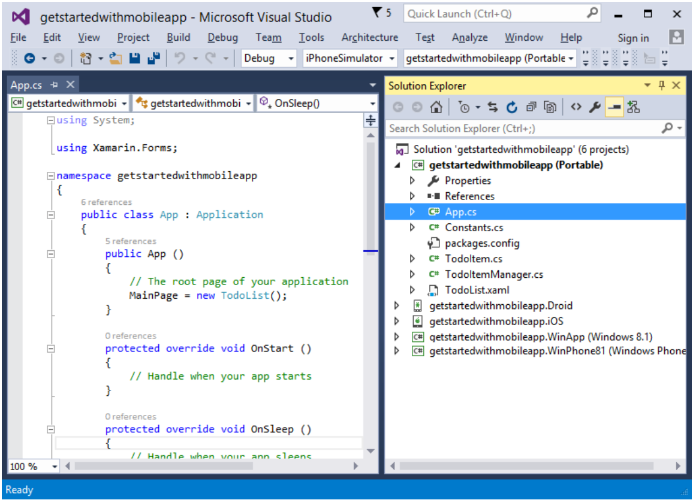

And here’s the, I believe improved, backend related code provided in the newer
Visual Studio Xamarin Forms template:

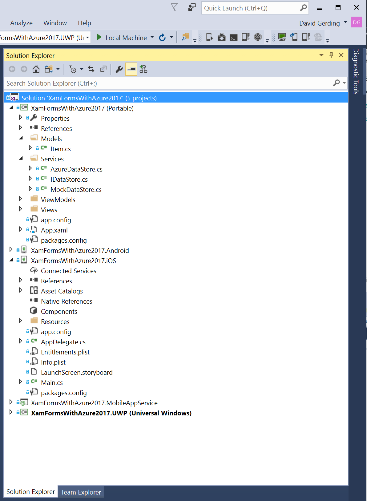

Reminder: you should be working against something that looks like the second
image :-)

### Carefully Update Your Nuget Packages for Solution

Firstly, **Do NOT install the Microsoft.Azure.Mobile.Client 4.0.1 Nuget.** Why?
The 4.0.1 version has documented conflicts with Android. See this
(https://github.com/Azure/azure-mobile-apps-net-client/issues/361). The 4.0.0
doesn’t. Moreover, updating the Android Nugets to level 25 *before* updating the
Azure mobile client is another “trick” get this all to compile. Feel free to
plow through the related Issues on GitHub, but trust me this approach works.
Hopefully soon the “stable” Mobile Client Nuget will be more stable.

Now, we’re going to very carefully update the Nuget packages.

Use the Nuget update manager for the solution but **deselect both the
Microsoft.Azure.Mobile.Client and its SqLite related sibling,
Microsoft.Azure.Mobile.Client.SQLiteStore** to ensure they stay on version 3.x
for now.

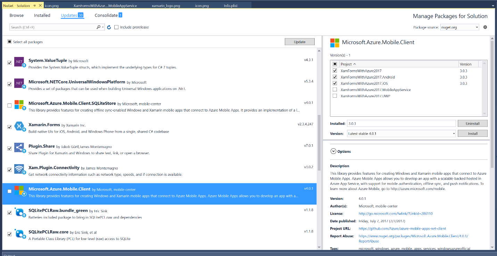

### Enable Migrations for Entity Framework and Adjust Code Accordingly

I’ve found that the starter code in the Azure backend project is hit and miss in
terms of doing the schema creation. Maybe it assumes the Items table is being
created manually? Regardless, the following steps should get you up and running
and prep your project to automatically update the backend database when you add
or alter your Entity Items.

#### Set Your App.xaml.cs to Use the Azure Data Store

First, change the **UseMockDataStore** property to false. This will ensure that
the AzureDataStore (Services/AzureDataStore.cs) is used at runtime.

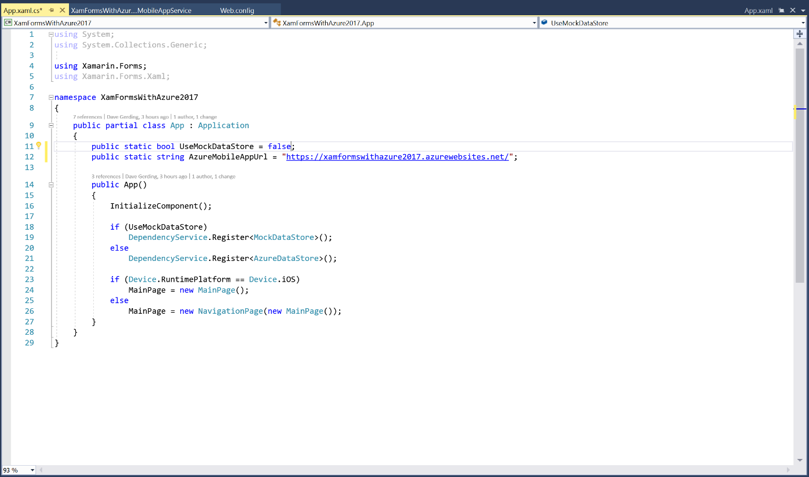

Second, make sure your **AzureMobileAppUrl** is *your* AzureMobileAppUrl, the
app service you made on Azure earlier, and not the url shown to mine shown
above. You can see both those edits to App.xaml.cs reflected above.

### Use Nuget Console to Enable Entity Framework Navigation Support

The Entity Framework is complex and massive. Those that know how to use it well
can do amazing things and make maintainable code that still uses strongly typed
data bound to traditional SQL data storage.

For an introduction to the Entity Framework and the Migration processes you can
check out these related links:

[todo: add links]

<https://docs.microsoft.com/en-us/aspnet/mvc/overview/getting-started/getting-started-with-ef-using-mvc/migrations-and-deployment-with-the-entity-framework-in-an-asp-net-mvc-application>

<https://msdn.microsoft.com/en-us/library/jj591621(v=vs.113).aspx>

In a nutshell, entity framework migration uses code generation to map changes in
the code representation of object relational mappings. Each “migration” winds up
being a class that has both an Up and Down method. The “Up” method specifies the
schema changes needed to make the database support the new or altered entity
classes. The “Down” method represents the changes to a database necessary to
revert the database back to the starting condition before the “Up” method in
that migration class was applied.

When done correctly the entity framework with migration support can work even in
dynamic environments like contemporary dev ops culture with frequent schema
changes. Since I am no entity framework expert I was pleased to simply get this
to work :-)

**Gotcha! Make Sure the App Service Project is Set as the Startup Project**

There’s a curious little trick to ensuring that the enable migrations step goes
off without a hitch. Before you begin make sure you set the app service project
as the startup project within the solution. Failing to do so can throw an error
where Enable-Migration process says as it can’t find the connection string. The
error will look like this. You’ve been warned.

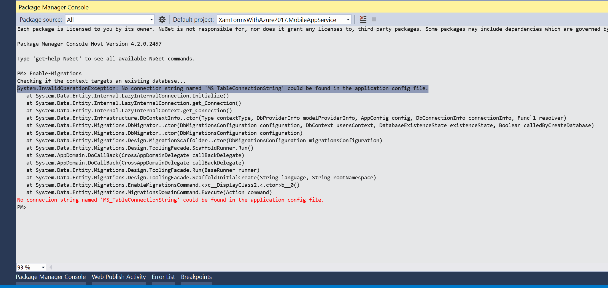

Open the Nuget Package Manager console. Set the default project your solutions
app service project. Also, make sure that that project is set as the startup
project in the current solution settings (see “Gotcha” above).

At the console enter

**Enable-Migrations**

and run the command. The related Nugets will be installed and a migration
related Configuration.cs class file will be added to your app service project in
the Migrations folder. Your app service project will look something like this:

The next step is to “memorialize” the starting condition of your object
relational model. At this point that is the single **Item.cs** entity you’ll
find in the **DataObjects** folder of the project. You can think of migrations
as named milestones that include the state of your object relational model at
that milestone. Migrations are date time stamped and are therefore presumed to
be run sequentially, by time stamp, to progress or regress a data model forward
or backward along milestones in the entity model development. More simply, with
a clean database, running all the migrations from oldest to newest will get the
database to match the current object model.

To create the “Initial” migration enter the following in the Nuget command
console prompt:

**Add-Migration Initial**

To be clear you can name migrations whatever you want but make sure, as with any
coding, to make the migration names descriptive and easy to follow.

The Add-Migration command will find the objects in your data objects folder that
inherit from **EntityData** and then do code generation, creating a class file
in the Migrations folder with the name “Initial” concatenated with the date time
stamp that has both the Up and Down methods required to alter the state of the
target database. The result should look like this:

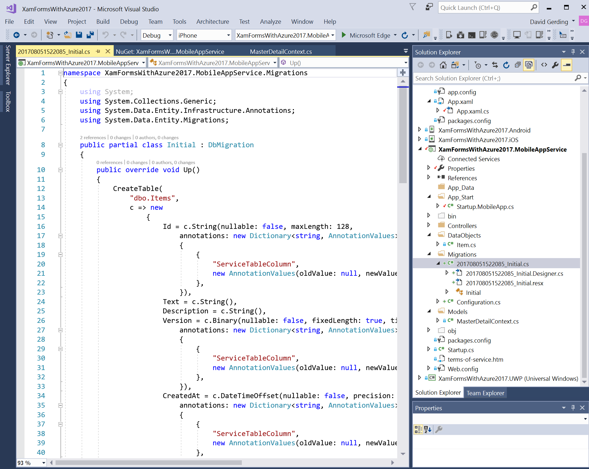

### Change Backend Initialization Behavior to Apply Migrations Automagically

Finally, to get the backend to automatically apply the “Initial” migrations, and
other changes we might make later using the EF migration process you just
learned, we’re going to alter the database initialization code in
AppStart/Startup.MobileApp.cs.

Here’s what the code should look like before the edits:

Note the **Database.SetInitializer** call around line 30. That’s the one were
going to change. We’re going to replace it with an initializer that will always
run any new migrations against the database. There are certainly cases when you
wouldn’t want to use this approach but this is fine for our purposes.

Your code should look like the code in lines 35 and 36 below, and don’t forget
to comment out the old initializer line and to include the new **using
System.Data.Entity.Migrations** statement.

Double check your code and compile the solution. Everything should be working at
this point. Now Publish your app service project to Azure using the right-click
publish functionality on the app service project. This time when the code is
published it will also create the Item table following the instructions in the
Initial migration class.

And remember, if you make changes to DataEntity classes in the app service
project and follow the Add-Migration process described above you should be able
to get your database to automatically update every time you publish. And that’s
pretty cool.

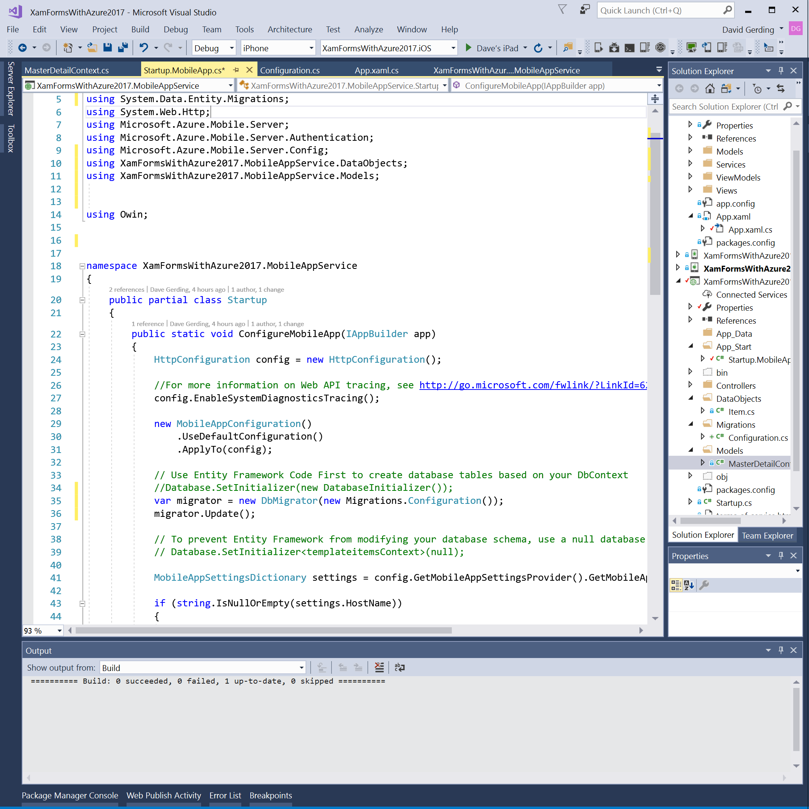

Step 5 – Create a .net Standard Clone of the Xamarin Forms PCL Project
----------------------------------------------------------------------

We’re nearly there!

The last step is to convert the existing Xamarin.Forms base project from a PCL
target to a .net Standard target.

**Gotcha – Don’t Bother “Converting” PCL to .Net Standard via Project
Properties**

Unfortunately, the tooling to convert a PCL project to a .net standard project
doesn’t work for Xamarin Forms projects yet. You need instead to “create and
copy”. Thanks to [todo: add link] for the early help with this conversion.

### Add a .net Standard Class Project

Add a new .net Standard class project in the solution and give it the same name
as the existing PCL Xamarin.Forms project with a “-standard” extension added to
the end of the name.

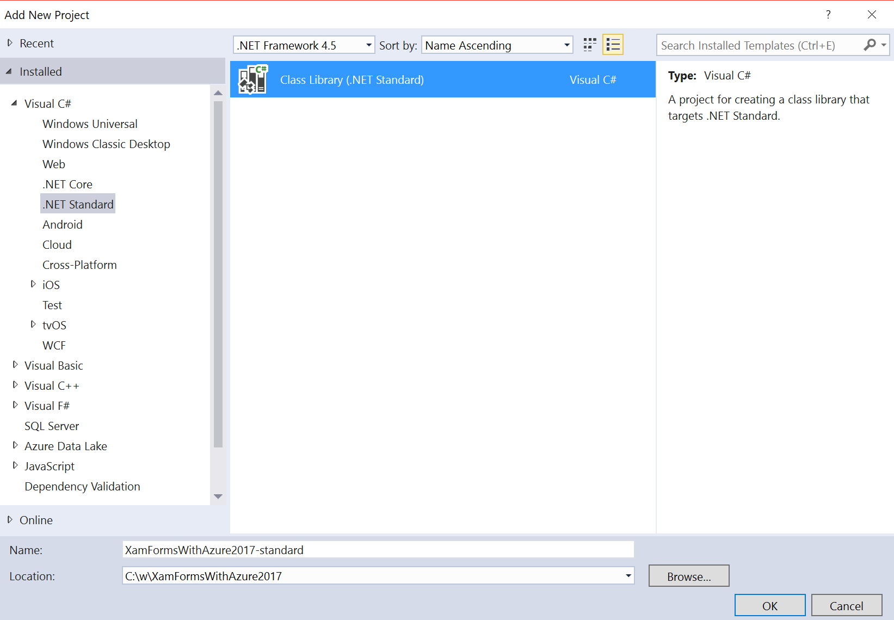

### Copy Some of the old PCL Project to the New .net Standard Project

Using File Explorer, copy most – but not all – of the existing PCL project
contents to the new .net Standard class project. You can also delete the old
Class.cs file. Note: Don’t copy the **packages.config** file. We want to use the
.net standard project to use the newer Nuget configuration style and not
packages.config. The highlighted items below *should* be copied to the new
project:

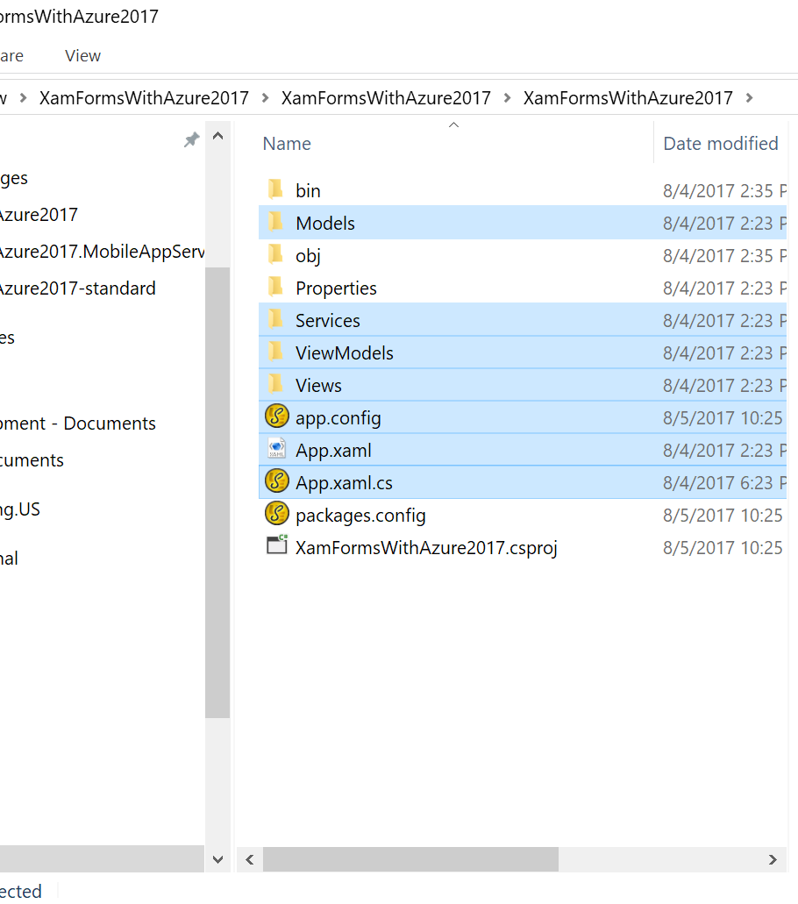

After you’ve copied from the PCL project the .net Standard project your solution
should look like this:

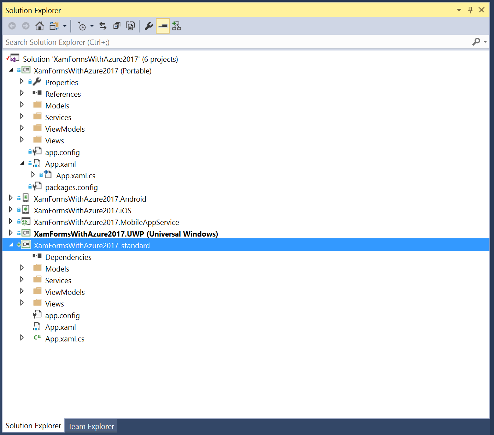

### Update Solution to use Prerelease Nuget Xamarin.Forms 2.3.5 pre-6

In this next step, we use the only pre-release Nuget package in the solution.
Perhaps a bit ironically it is the Xamarin.Forms Nuget package itself. The 2.3.4
package while stable does not yet work with.net standard projects. However, the
current 4.X azure mobile client Nuget packages, which are deemed stable, *only*
work with a .net standard project. We need the 4.X azure mobile client for
authentication to work correctly due to some changes in requirements from the
third-party authentication providers like Google that finally went into force in
the first half of 2017.

Using the Nuget Package Manager *temporarily* set the view to include prerelease
Nuget packages and update *only* the **Xamarin.Forms** package to the latest
pre-release version. As of this writing that is **2.3.5 pre6**.

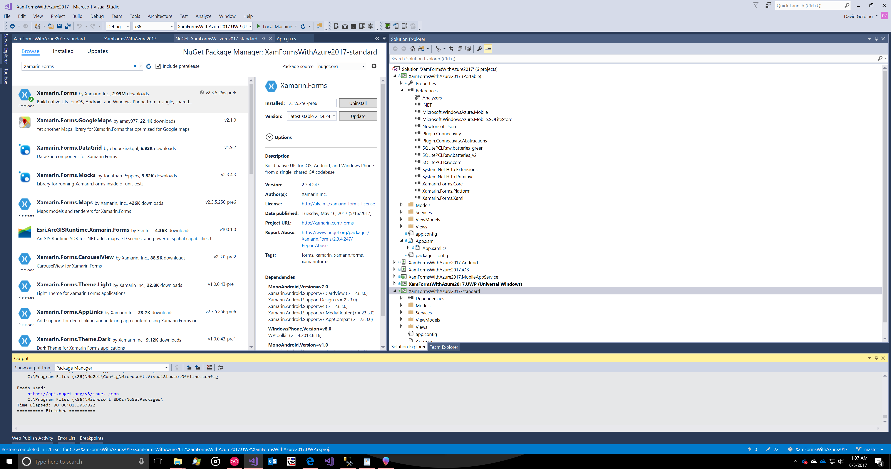

### Update Solution to use Microsoft Azure Mobile Nugets 4.0.0

Next, add the **Microsoft.Azure.Mobile.Client 4.0.0** Nuget and the
**Microsoft.Azure.Mobile.Client.SQLiteStore 4.0.0** to the .net Standard
project.

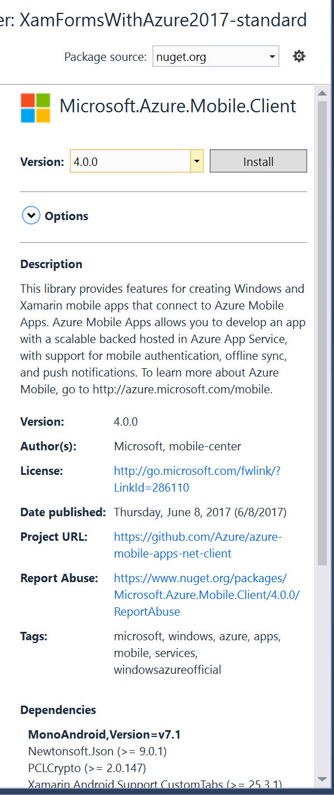

**Gotcha – Use “Azure Mobile Client” as the Nuget Search Term for
Microsoft.Azure.Mobile.Client**

For some strange reason, probably something about metadata, using the full Nuget
name for the Azure Mobile Client, Microsoft.Azure.Mobile.Client, even without
the periods, doesn’t return the Nuget package in the Nuget package search
results. Using “Azure Mobile Client” works.

Use the Nuget Package Manager again and update all references in the solution to
**Microsoft.Azure.Mobile.Client** and
**Microsoft.Azure.Mobile.Client.SQLiteStore** to version 4.0.0. **Don’t use
4.0.1. See this to understand why:**

**https://github.com/Azure/azure-mobile-apps-net-client/issues/361**

### Set the XAML Files in the .net Standard Project to Embedded Resource

The file copy we did earlier to bring the pcl project over to the.net standard
project didn’t include the metadata needed to get the XAML files to build. Set
all of the XAML files to Embedded Resource.

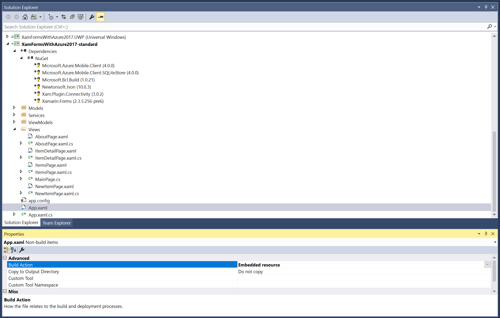

### Add or Verify Complete BCL Nuget References in Packages.Config Files

The current tooling sometimes seems to exclude the complete BCL Nuget references
in the **packages.config** files. If you get any BCL related build errors at
this point make sure that there are references to **both Microsoft.BCL and
Microsoft.BCL.Build** in any packages.config files in any of the projects in the
solution. If you’re copying and pasting make sure that your target framework
property matches the correct target framework value for that project :-)

### [./media/image22.png](./media/image22.png)

~   C:\\Users\\david\\AppData\\Local\\Microsoft\\Windows\\INetCache\\Content.Word\\EnsureMicrosoftBclInPackagesConfigForEachPlatform.png

Act 1 – Completed
-----------------

Hooray! The current commit for the repo associated with this walk-through builds
and runs on iOS, android, and UWP platforms. It also synchronizes correctly
against a SQL supported backend that has migrations enabled. And it’s ready for
our next step which is to add authentication.

I’m going to make a separate repo for “act two” and “act three” of this
walk-through. You can find those repose here

[todo:add links]

and here

[todo:add links]

, respectively.

Act 2 – Authentication, Notifications and a “Completed” Solution
================================================================

Coming very soon.

Act 3 – An Opinionated Take on the Solution Template
====================================================

Coming soon

\-Dave Gerding

